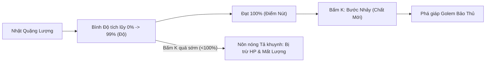
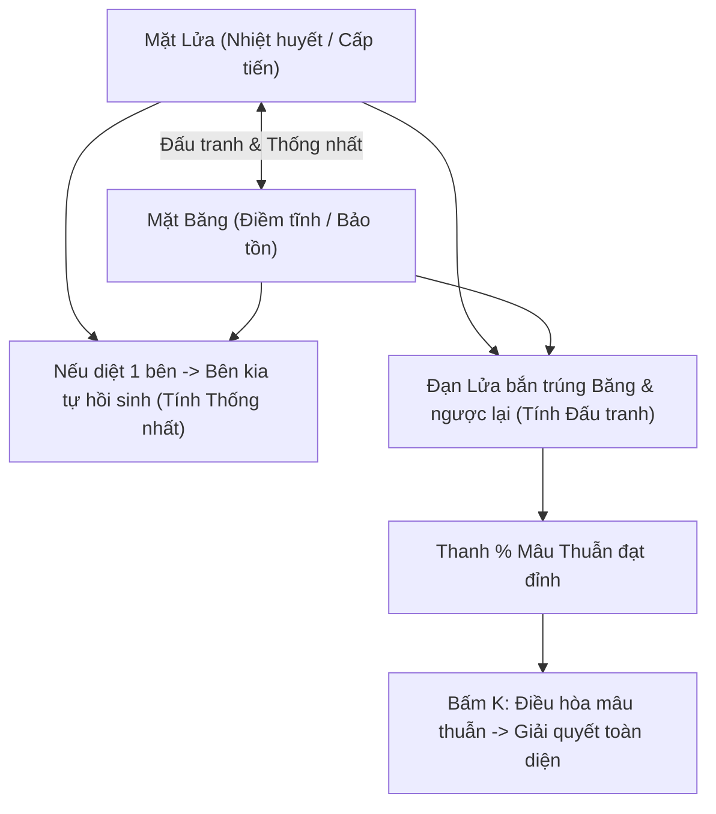
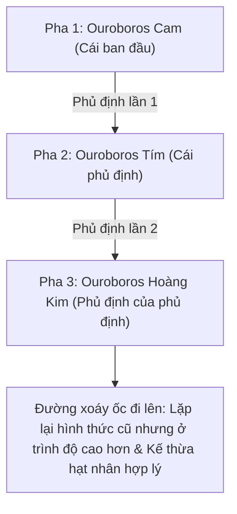
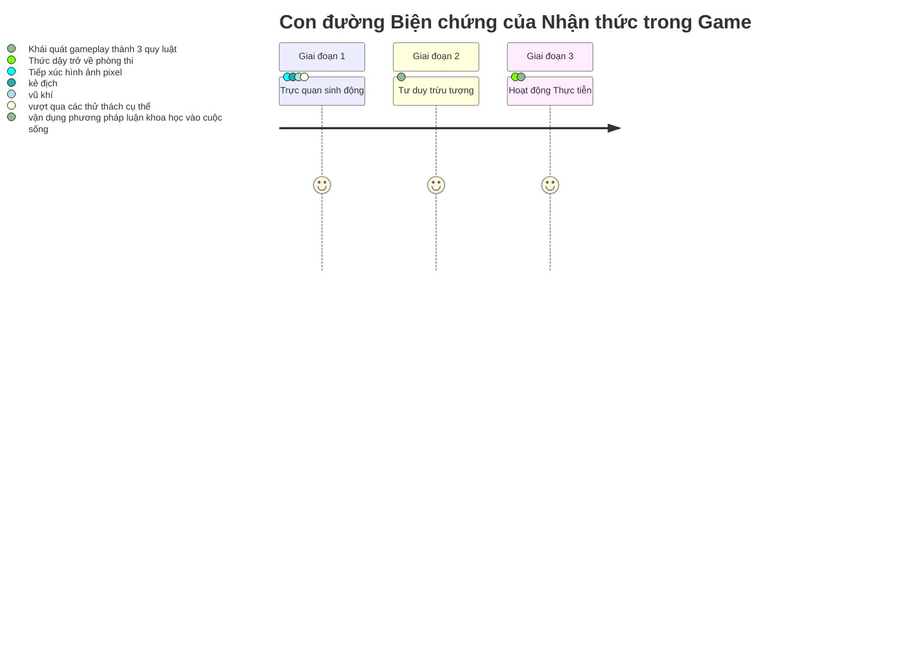

# PIXEL MARX: DẤU CHÂN TRIẾT GIA
## TÀI LIỆU CHI TIẾT: CÁC THÀNH PHẦN TRONG GAME & ÁNH XẠ NỘI DUNG HỌC THUẬT TRIẾT HỌC MÁC - LÊNIN (MLN111)

> **Mục đích tài liệu:** Phân tích chi tiết toàn bộ nhân vật, quái vật, vật phẩm, cơ chế gameplay và chỉ rõ từng thành phần tượng trưng cho khái niệm/quy luật nào trong giáo trình Triết học Mác - Lênin (MLN111). ## MỤC LỤC
1. [Tổng quan thiết kế & Triết lý Gamification](#1-tổng-quan-thiết-kế--triết-lý-gamification)
2. [Các thành phần cốt lõi chung của Game](#2-các-thành-phần-cốt-lõi-chung-của-game)
3. [Phân tích chi tiết 3 Màn chơi: Thành phần $\leftrightarrow$ 3 Quy luật Phép Biện chứng](#3-phân-tích-chi-tiết-3-màn-chơi-thành-phần--3-quy-luật-phép-biện-chứng)
   - [Màn 1: Quy luật Lượng - Chất](#màn-1-quy-luật-lượng---chất)
   - [Màn 2: Quy luật Mâu thuẫn](#màn-2-quy-luật-mâu-thuẫn)
   - [Màn 3: Quy luật Phủ định của Phủ định](#màn-3-quy-luật-phủ-định-của-phủ-định)
4. [Phân tích hoạt cảnh Ending: 3 Nấc thang của quá trình nhận thức](#4-phân-tích-hoạt-cảnh-ending-3-nấc-thang-của-quá-trình-nhận-thức)
5. [Bộ câu hỏi vấn đáp bảo vệ sản phẩm sáng tạo MLN111](#5-bộ-câu-hỏi-vấn-đáp-bảo-vệ-sản-phẩm-sáng-tạo-mln111)

---

## 1. TỔNG QUAN THIẾT KẾ & TRIẾT LÝ GAMIFICATION

Môn **Triết học Mác - Lênin (MLN111)** thường bị xem là trừu tượng, khó tiếp thu do chứa nhiều phạm trù lý luận phức tạp, đặc biệt là **3 Quy luật cơ bản của Phép biện chứng duy vật**. Dự án **PIXEL MARX** giải quyết vấn đề này bằng cách **"Trò chơi hóa" (Gamification)**:
- **Biến khái niệm thành thực thể:** Các thuật ngữ triết học (Lượng, Độ, Điểm Nút, Bước Nhảy, Mặt đối lập, Mâu thuẫn, Phủ định của phủ định, Kế thừa) trở thành quái vật, vật phẩm, công tắc, thanh năng lượng có thể nhìn thấy và tương tác.
- **Biến quy luật thành cơ chế chơi:** Người chơi không thể "học vẹt" mà buộc phải "hành động đúng quy luật" mới có thể vượt qua thử thách.
- **Cầu nối nhận thức:** Người chơi tiếp xúc qua *Trực quan sinh động* (chơi game) $\rightarrow$ đúc kết thành *Tư duy trừu tượng* (đọc popup kiến thức) $\rightarrow$ vận dụng vào *Thực tiễn* (phương pháp luận trong học tập và cuộc sống).

---

## 2. CÁC THÀNH PHẦN CỐT LÕI CHUNG CỦA GAME

| Thành phần trong Game | Hình ảnh / Biểu hiện | Ý nghĩa biểu tượng trong Triết học Mác - Lênin |
|---|---|---|
| **Sinh viên FPT** (Nhân vật chính) | Sprite pixel mang áo sinh viên | Tượng trưng cho **Con người hoạt động thực tiễn / Chủ thể nhận thức**. Con người đóng vai trò trung tâm trong việc cải tạo thế giới khách quan. |
| **Cái cày Pixel** (Vũ khí cận chiến `J`) | Lưỡi kiếm/cày pixel chém cận chiến | Tượng trưng cho **Công cụ lao động & Hoạt động thực tiễn**. Triết học Mác khẳng định thực tiễn (lao động sản xuất) là phương thức cơ bản để con người tác động, biến đổi hiện thực khách quan. |
| **Cuốn sách Triết** (Vật phẩm đồng hành) | Cuốn sách phát sáng | Tượng trưng cho **Tri thức khoa học / Lý luận Mác - Lênin**. Lý luận soi đường cho thực tiễn, giúp chủ thể định hướng hành động đúng đắn. |
| **Ly Cà phê Ký túc xá** (Heart Pickup) | Trái tim/ly cà phê hồi máu | Tượng trưng cho **Tư liệu sinh hoạt / Điều kiện duy trì sức lao động**. Để tiếp tục hoạt động thực tiễn, người lao động cần tái sản xuất sức lao động. |
| **Cổng Nhận Thức** (Portal qua màn) | Vòng tròn năng lượng phát sáng | Tượng trưng cho **Sự chuyển tiếp của nhận thức**. Mỗi khi giải quyết xong một mâu thuẫn/nhiệm vụ, nhận thức của con người bước lên một nấc thang cao hơn. |
| **Popup Tổng kết Học thuật** | Modal hiển thị định nghĩa sau mỗi màn | Đóng vai trò là **Giai đoạn chuyển hóa từ kinh nghiệm trực quan sang khái quát lý luận**. |

---

## 3. PHÂN TÍCH CHI TIẾT 3 MÀN CHƠI: THÀNH PHẦN $\leftrightarrow$ 3 QUY LUẬT PHÉP BIỆN CHỨNG

---

### MÀN 1: QUY LUẬT LƯỢNG - CHẤT

> **Chủ đề học thuật:** Quy luật chuyển hóa từ những thay đổi về lượng thành những thay đổi về chất và ngược lại. Tích lũy về lượng đến Điểm Nút sẽ dẫn tới sự thay đổi về chất thông qua Bước Nhảy.

#### Bảng đối chiếu thành phần Màn 1:

| Thành phần Game | Hành vi / Cơ chế Gameplay | Luận điểm Triết học MLN111 tương ứng |
|---|---|---|
| **Quặng Lượng (Ore)** | Các viên quặng rải rác trên đường, người chơi phải đi nhặt | Tượng trưng cho **Quá trình tích lũy dần dần về Lượng** (số lượng, quy mô, mức độ). Sự thay đổi về lượng diễn ra từ từ, tuần tự. |
| **Bình Độ (Degree Bar)** | Cột đo hiển thị từ 0% đến 100% bên trái màn hình | Đại diện cho phạm trù **ĐỘ**: Khoảng giới hạn mà trong đó sự thay đổi về lượng chưa làm thay đổi căn bản về chất của sự vật (vẫn là đòn đánh yếu, chưa phá được giáp). |
| **Mức 100% của Bình Độ** | Mốc điều kiện để được phép thi triển kỹ năng | Đại diện cho phạm trù **ĐIỂM NÚT**: Thời điểm/giới hạn mà tại đó sự tích lũy về lượng đã đạt đủ điều kiện để làm thay đổi về chất. |
| **Kỹ năng `K`: Bước Nhảy (Leap)** | Người phát sáng vàng trong 10s, tốc độ chạy tăng, lực chém tăng vọt | Đại diện cho phạm trù **BƯỚC NHẢY**: Sự chuyển hóa căn bản về chất của sự vật do sự tích lũy về lượng trước đó tạo ra. Nhân vật chuyển sang một "chất mới" mạnh mẽ hơn. |
| **Phạt máu khi bấm `K` sớm ($<100\%$)** | Bị trừ 12 HP kèm thông báo: *"Nôn nóng tả khuynh: chưa đủ lượng mà đòi nhảy chất"* | Cảnh báo **Sai lầm phương pháp luận: Nôn nóng, chủ quan duy ý chí (Tả khuynh)** — Đòi thay đổi chất khi lượng chưa tích lũy đến điểm nút. |
| **Quái bọc thép & Golem Bảo Thủ** | Miễn nhiễm đòn thường, chỉ bị tiêu diệt khi nhân vật đang bật Bước Nhảy | Biểu thị **Tính bảo thủ, trì trệ (Hữu khuynh)** của chất cũ. Nếu không có Bước nhảy về chất thì không thể phá vỡ được trạng thái bảo thủ của sự vật cũ. |

---

### MÀN 2: QUY LUẬT MÂU THUẪN

> **Chủ đề học thuật:** Quy luật thống nhất và đấu tranh của các mặt đối lập. Mâu thuẫn biện chứng là nguồn gốc, động lực bên trong của mọi sự vận động và phát triển.

#### Bảng đối chiếu thành phần Màn 2:

| Thành phần Game | Hành vi / Cơ chế Gameplay | Luận điểm Triết học MLN111 tương ứng |
|---|---|---|
| **Công tắc LỬA & BĂNG** | 2 công tắc đỏ và xanh ở đầu màn, bắt buộc phải bật cả 2 mới mở cổng | Tượng trưng cho **Hai mặt đối lập**: Những mặt có khuynh hướng, tính chất trái ngược nhau nhưng cùng tồn tại trong một chỉnh thể. |
| **Cổng Đối Lập mở ra** | Chỉ mở khi cả 2 công tắc cùng kích hoạt | Biểu thị: Sự phát triển chỉ bắt đầu khi **Mâu thuẫn biện chứng** được hình thành từ sự tương tác của cả hai mặt đối lập. |
| **Boss Song Sinh Thái Cực** (Mặt Lửa & Mặt Băng) | Hai thực thể tồn tại song song, chia sẻ không gian chiến đấu | Tượng trưng cho **Sự thống nhất của các mặt đối lập**: Các mặt đối lập nương tựa, ràng buộc, làm tiền đề tồn tại cho nhau. |
| **Cơ chế Hồi sinh tự động (2.2s)** | Nếu người chơi chỉ đánh chết 1 bên, bên còn lại sẽ tự động hồi sinh bên kia | **Tính chỉnh thể của mâu thuẫn**: Không thể xóa bỏ một mặt đối lập mà để mặt kia tồn tại đơn độc. Giải quyết mâu thuẫn phải xem xét toàn diện cả hai mặt. |
| **Đạn Lửa bắn trúng Băng và ngược lại** | Đạn của mặt này bắn trúng mặt kia sẽ gây sát thương lớn và tăng nhanh % Mâu thuẫn | Tượng trưng cho **Sự đấu tranh của các mặt đối lập**: Khuynh hướng tác động qua lại, bài trừ, phủ định lẫn nhau giữa các mặt đối lập. |
| **Kỹ năng `K`: Điều hòa Mâu thuẫn** | Kéo lượng máu của 2 mặt về mức cân bằng khi mâu thuẫn chín muồi ($\ge 50\%$) | **Giải quyết mâu thuẫn biện chứng**: Khi mâu thuẫn phát triển đến độ gay gắt và hội tụ đủ điều kiện, chủ thể thực tiễn can thiệp để chuyển hóa các mặt đối lập, đưa sự vật lên trạng thái mới. |

---

### MÀN 3: QUY LUẬT PHỦ ĐỊNH CỦA PHỦ ĐỊNH

> **Chủ đề học thuật:** Quy luật phủ định của phủ định chỉ ra khuynh hướng, hình thức và con đường của sự phát triển: Phát triển theo đường xoáy ốc đi lên, có tính chu kỳ và tính kế thừa biện chứng.

#### Bảng đối chiếu thành phần Màn 3:

| Thành phần Game | Hành vi / Cơ chế Gameplay | Luận điểm Triết học MLN111 tương ứng |
|---|---|---|
| **Boss Phượng Hoàng Ouroboros** | Boss hình tượng rồng/phượng hoàng tự cắn đuôi (biểu tượng của chu kỳ và sự tự phủ định) | Đại diện cho **Tính khách quan và tự thân của Phủ định biện chứng**: Sự vật tự phủ định chính mình do mâu thuẫn nội tại thúc đẩy. |
| **3 Pha chiến đấu liên tiếp (Cam $\rightarrow$ Tím $\rightarrow$ Vàng)** | Mỗi khi cạn máu, Boss không biến mất mà tái sinh ở cấp độ cao hơn (tốc độ nhanh hơn, đạn nhiều hơn) | Tượng trưng cho **Quy luật Phủ định của Phủ định**: Kết thúc một chu kỳ phát triển, sự vật dường như lặp lại cái cũ về hình thức nhưng ở trình độ cao hơn về chất. |
| **Pha 2 kháng 55% sát thương** | Boss tím có sức đề kháng cao với các đòn đánh thông thường cũ | Biểu thị: Cái mới ra đời có sức sống mạnh mẽ hơn cái cũ; không thể dùng tư duy và công cụ cũ kỹ để giải quyết giai đoạn phát triển mới. |
| **Kỹ năng `K`: Kế thừa Biện chứng** | Tích lũy năng lượng từ việc đánh Boss và dọn tàn dư $\rightarrow$ Bật K để nhận buff tăng 45% sát thương | Đại diện cho **Tính kế thừa có chọn lọc**: Phủ định biện chứng không phải "xóa sạch trơn" (siêu hình) mà là giữ lại và phát huy những hạt nhân hợp lý của giai đoạn trước để tạo sức mạnh mới. |
| **Tàn dư phủ định (Quái mặt đất)** | Quái vật xuất hiện dưới đất đòi hỏi người chơi dùng `J` cận chiến dọn dẹp | Tượng trưng cho **Những yếu tố tiêu cực, lỗi thời của cái cũ** cần được lọc bỏ trong quá trình kế thừa. |
| **Bắn xa (Click chuột)** | Đạn năng lượng tầm xa diệt Boss bay | Thể hiện sự phát triển công cụ nhận thức và hành động của chủ thể ở nấc thang cao hơn. |

---

## 4. PHÂN TÍCH HOẠT CẢNH ENDING: 3 NẤC THANG CỦA QUÁ TRÌNH NHẬN THỨC

Sau khi hoàn thành 3 màn chơi (3 quy luật biện chứng), người chơi bước vào chuỗi màn hình kết thúc (Ending Screen) thể hiện quan điểm của V.I. Lênin về con đường biện chứng của nhận thức chân lý:

$$\text{Từ trực quan sinh động} \longrightarrow \text{Đến tư duy trừu tượng} \longrightarrow \text{Về lại thực tiễn}$$

1. **Giai đoạn 1 — Trực quan sinh động (Nhận thức cảm tính):** Người học tiếp xúc với các hiện tượng cụ thể, tình huống, hình ảnh trực quan và nhiệm vụ trong game (nhặt quặng, bật công tắc, né đạn, chém quái).
2. **Giai đoạn 2 — Tư duy trừu tượng (Nhận thức lý tính):** Người học xử lý thông tin, đọc các popup tổng kết học thuật, đúc kết 3 quy luật biện chứng duy vật chi phối sự vận động và phát triển.
3. **Giai đoạn 3 — Thực tiễn (Mục đích & Tiêu chuẩn của chân lý):** Sinh viên thức dậy, đem tri thức đã giác ngộ quay trở lại phòng thi và cuộc sống. Nhận thức đúng đắn trở thành kim chỉ nam cho hành động thực tiễn.

---

## 5. BỘ CÂU HỎI VẤN ĐÁP BẢO VỆ SẢN PHẨM SÁNG TẠO MLN111

Dưới đây là các câu hỏi thường gặp khi giảng viên chấm điểm đồ án sáng tạo kèm gợi ý trả lời chuẩn triết học:

### ❓ Câu 1: Tại sao trong game lại dùng "Cái cày Pixel" làm vũ khí chính của nhân vật?
> **Trả lời:** Cái cày là biểu tượng kinh điển của công cụ lao động trong nền sản xuất vật chất. Triết học Mác khẳng định: *Lao động sản xuất là hoạt động thực tiễn cơ bản nhất*, thông qua công cụ lao động con người mới cải tạo được giới tự nhiên và phát triển xã hội. Đặt cái cày làm vũ khí thể hiện lập trường duy vật thực tiễn: con người cải tạo thế giới bằng hành động vật chất, không phải bằng ảo tưởng tâm linh.

### ❓ Câu 2: Trong Màn 1 (Lượng - Chất), tại sao người chơi nhấn phím K sớm khi chưa đủ 100% Lượng thì lại bị trừ máu?
> **Trả lời:** Cơ chế này nhằm minh họa cho **sai lầm phương pháp luận "Tả khuynh" (nôn nóng, chủ quan duy ý chí)**. Khi Lượng chưa tích lũy đến Điểm Nút mà đã nóng vội muốn đốt cháy giai đoạn để thay đổi Chất thì sẽ dẫn đến thất bại, gây tổn hại trong thực tế.

### ❓ Câu 3: Cơ chế Màn 2 thể hiện tính thống nhất và đấu tranh của các mặt đối lập như thế nào?
> **Trả lời:** 
> - **Tính thống nhất:** Thể hiện qua việc hai Boss Lửa và Băng cùng nương tựa nhau để tồn tại; nếu người chơi chỉ diệt 1 bên thì bên kia sẽ tự động hồi sinh bên đã mất.
> - **Tính đấu tranh:** Thể hiện qua việc đạn của bên này có thể làm tổn thương bên kia (triệt tiêu, phủ định nhau). Người chơi phải nắm được cả hai mặt thì mới điều hòa và giải quyết được mâu thuẫn toàn diện.

### ❓ Câu 4: Ở Màn 3, Boss Ouroboros 3 Pha và Kỹ năng Kế thừa thể hiện quy luật Phủ định của Phủ định ra sao?
> **Trả lời:** 
> - **3 Pha xoáy ốc:** Pha 1 (khởi đầu) $\rightarrow$ Pha 2 (phủ định lần 1) $\rightarrow$ Pha 3 (phủ định của phủ định). Kết thúc chu kỳ, Boss tái sinh thành hình thái hoàng kim mạnh nhất, lặp lại hình thức nhưng ở trình độ cao hơn.
> - **Kế thừa biện chứng:** Kỹ năng K giúp người chơi kế thừa sức mạnh tinh hoa từ các pha trước, đồng thời loại bỏ các tàn dư lỗi thời (quái mặt đất) để dứt điểm chu kỳ phát triển.
